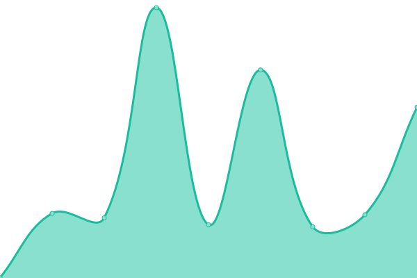
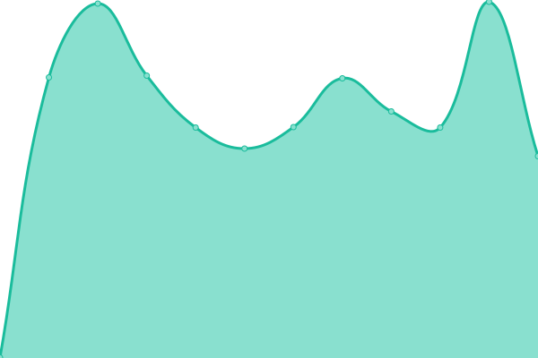

# [📈 Live Status](https://status.rheinklang.events): <!--live status--> **🟧 Partial outage**

This repository contains the open-source uptime monitor and status page for [Rheinklang](rheinklang.events), powered by [Upptime](https://github.com/upptime/upptime).

With [Upptime](https://upptime.js.org), you can get your own unlimited and free uptime monitor and status page, powered entirely by a GitHub repository. We use [Issues](https://github.com/rheinklang/upptime/issues) as incident reports, [Actions](https://github.com/rheinklang/upptime/actions) as uptime monitors, and [Pages](https://status.rheinklang.events) for the status page.

<!--start: status pages-->
<!-- This summary is generated by Upptime (https://github.com/upptime/upptime) -->
<!-- Do not edit this manually, your changes will be overwritten -->
<!-- prettier-ignore -->
| URL | Status | History | Response Time | Uptime |
| --- | ------ | ------- | ------------- | ------ |
|  [Website](https://rheinklang.events) | 🟩 Up | [website.yml](https://github.com/rheinklang/upptime/commits/HEAD/history/website.yml) | 

 1226ms
     
 | 

<a href="https://status.rheinklang.events/history/website">89.99%</a>
    

|  [Bio Links](https://bio.rheinklang.events/links) | 🟩 Up | [bio-links.yml](https://github.com/rheinklang/upptime/commits/HEAD/history/bio-links.yml) | 

 825ms
     
 | 

<a href="https://status.rheinklang.events/history/bio-links">100.00%</a>
    

|  CMS | 🟩 Up | [cms.yml](https://github.com/rheinklang/upptime/commits/HEAD/history/cms.yml) | 

 654ms
     
 | 

<a href="https://status.rheinklang.events/history/cms">90.60%</a>
    

|  Accounting | 🟥 Down | [accounting.yml](https://github.com/rheinklang/upptime/commits/HEAD/history/accounting.yml) | 

 0ms
     
 | 

<a href="https://status.rheinklang.events/history/accounting">0.00%</a>
    

|  Kanboard | 🟥 Down | [kanboard.yml](https://github.com/rheinklang/upptime/commits/HEAD/history/kanboard.yml) | 

 2542ms
     
 | 

<a href="https://status.rheinklang.events/history/kanboard">0.00%</a>
    

<!--end: status pages-->

[**Visit our status website →**](https://status.rheinklang.events)

## 📄 License

- Powered by: [Upptime](https://github.com/upptime/upptime)
- Code: [MIT](./LICENSE) © [Rheinklang](rheinklang.events)
- Data in the `./history` directory: [Open Database License](https://opendatacommons.org/licenses/odbl/1-0/)
